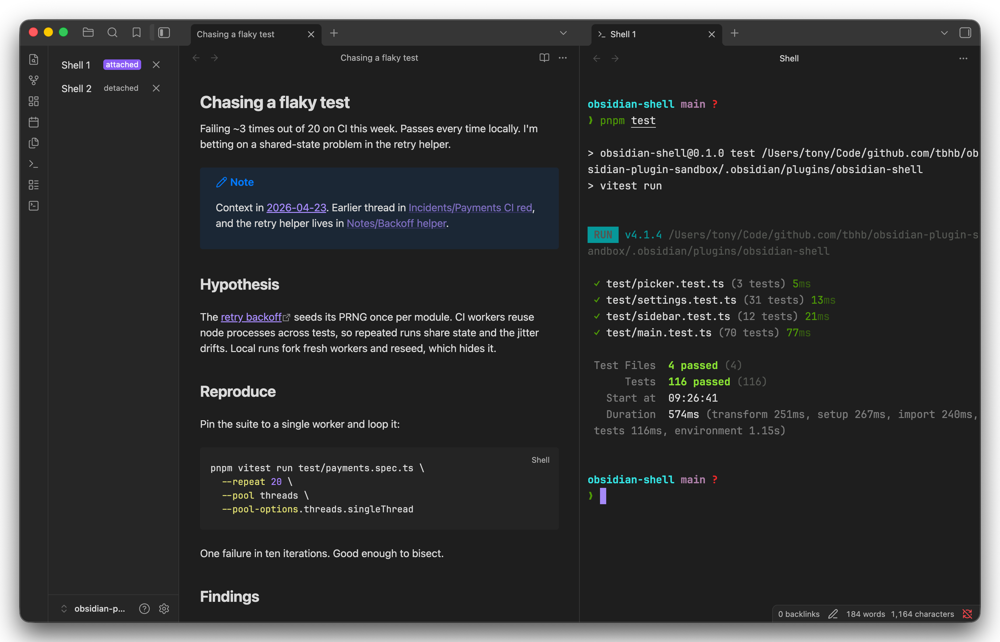

# obsidian-shell

An desktop-only, embedded terminal for [Obsidian][obsidian], powered by [xterm.js][xtermjs] and [node-pty][node-pty].

[obsidian]: https://obsidian.md/
[xtermjs]: https://xtermjs.org/
[node-pty]: https://github.com/microsoft/node-pty



## Features

- Multi-session shells, one shell per Obsidian leaf. Tab labels number sessions Shell 1, Shell 2, and so on.
- Sessions survive pane drags and leaf closures. Reopen a detached shell from the sidebar or the fuzzy picker and its scrollback comes back with you.
- Left-sidebar `Shells` panel with a live list, state badges for attached, detached, and exited sessions, click-to-switch, and per-row stop buttons. Reachable from a ribbon icon.
- Obsidian theme integration. The `Follow Obsidian theme` toggle maps the vault's CSS variables into xterm's background, foreground, cursor, and selection colors.
- WebGL rendering that matches VS Code's terminal, with a DOM fallback for machines without a GPU context.
- Settings for shell path and arguments, starting directory strategy, font family with a monospace detector, font size, line height, cursor style and blink, scrollback, and copy on selection.
- First enable auto-opens a shell. Later enables and Hot Reload cycles leave the workspace alone.

## Commands

- **Open shell** reveals an existing terminal or opens one in the right sidebar.
- **New shell** always opens a fresh shell in a new tab.
- **Switch shell** opens a fuzzy picker of every tracked session.
- **Kill shell** and **Restart shell** act on the active terminal leaf.
- **Kill all shells** ends every session at once.
- **Open shells sidebar** reveals the `Shells` panel. The ribbon icon does the same.
- **Run self-test** spawns `uname` through node-pty and surfaces the output via a Notice. Handy when diagnosing a native-binary problem after a rebuild.

## Install

The plugin targets desktop Obsidian. The mobile app skips the plugin because node-pty can't load there.

Obsidian's community catalog and [BRAT] only deliver `main.js`, `manifest.json`, and `styles.css`. Neither carries this plugin's platform-specific native binary, so installation stays manual for now.

[brat]: https://tfthacker.com/brat-developers

### Manual install

Grab the latest [release][releases] and copy these assets into `.obsidian/plugins/obsidian-shell/`, creating the folder first if it doesn't exist:

- `main.js`
- `manifest.json`
- `styles.css`
- `pty-<platform>-<arch>.node` matching your system, such as `pty-darwin-arm64.node` on Apple silicon or `pty-linux-x64.node` on 64-bit Linux
- On macOS only, the matching `spawn-helper-<platform>-<arch>` file. Linux node-pty doesn't build one and Windows doesn't need one
- On Windows only, `conpty-win32-x64.node` and `conpty_console_list-win32-x64.node` alongside `pty-win32-x64.node`

On macOS, mark the `spawn-helper` executable:

```bash
chmod +x .obsidian/plugins/obsidian-shell/spawn-helper-*
```

Restart Obsidian or toggle community plugins off and on, then enable `Shell` under **Settings → Community plugins**. The first enable opens a starter shell.

[releases]: https://github.com/tbhb/obsidian-shell/releases

### From source

Contributors and anyone debugging a local build should follow the from-source setup in [`DEVELOPMENT.md`](DEVELOPMENT.md). That path compiles node-pty against Obsidian's Electron runtime via `pnpm rebuild:native`.

## Development

Read [`DEVELOPMENT.md`](DEVELOPMENT.md) for the full contributor guide. It covers prerequisites, the inner development loop, the linting and testing gate, commit conventions, and a pointer to the release pipeline. [`AGENTS.md`](AGENTS.md) has the condensed version aimed at AI coding agents, and Claude Code imports it automatically via [`CLAUDE.md`](CLAUDE.md).

Release details, including asset layout and verification instructions, live in [`RELEASING.md`](RELEASING.md).

## Artificial intelligence disclosure

Claude helped draft code, tests, documentation, and the release pipeline under human direction. See [`AI_DISCLOSURE.md`](AI_DISCLOSURE.md) for the full Artificial Intelligence Disclosure (AID) statement.

## License

Released under the [MIT License](LICENSE).
